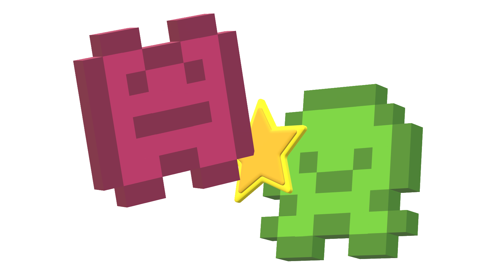

<h1>
  
  Spirit Showdown
</h1>

## About
Spirit Showdown is a turn-based two-player web-app board game that takes inspiration from the now defunct 2016 mobile game Pokémon Duel. What makes Spirit Showdown unique is that all characters and their sprite are are randomly generated to create a unique gaming experience every time!

## How to Play
The game board contains several kinds of tiles, the most important of which are the player spawn tiles. Each player has their own spawn tiles, which are the only tiles by which their spirits can enter the board. The objective of the game is to block your opponent's spawn tiles, preventing them from spawning in new spirits and winning you the game.  
See full explanation [here](https://spirit-showdown.firebaseapp.com/how-to-play). 

### TODO
* Code cleanup and refactoring
* Changes to server-side and client-side game logic
* Visual improvements: change font, add bg art and give the game a unique look
* Fix firebase url paths not working
* Change generation to be based on url path (related to above point)
* Finished README.md